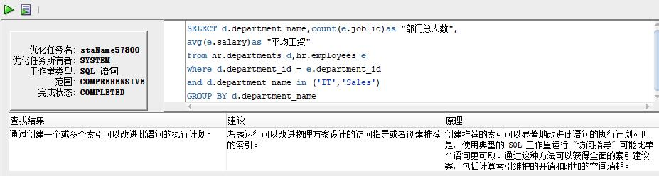

# 实验1：SQL语句的执行计划分析与优化指导
## 2018软件工程2班  黄浩 201810111210
## 实验目的：
分析SQL执行计划，执行SQL语句的优化指导。理解分析SQL语句的执行计划的重要作用。
## 实验内容：
1. 对Oracle12c中的HR人力资源管理系统中的表进行查询与分析。
2. 设计自己的查询语句，并作相应的分析，查询语句不能太简单。
## 分析教材查询：

### sql语句1：
```sql
SELECT d.department_name,count(e.job_id)as "部门总人数",
avg(e.salary)as "平均工资"
from hr.departments d,hr.employees e
where d.department_id = e.department_id
and d.department_name in ('IT','Sales')
GROUP BY d.department_name;
```


### sql语句2：
```sql
SELECT d.department_name,count(e.job_id)as "部门总人数",
avg(e.salary)as "平均工资"
FROM hr.departments d,hr.employees e
WHERE d.department_id = e.department_id
GROUP BY d.department_name
HAVING d.department_name in ('IT','Sales');
```

### 分析：
根据其优化指导中的详细信息可分析得:第一个sql查询语句Cost=5，Rows=20，Predicate Information中有一次全表搜索filter和一次索引搜索access。
第二个查询语句和第一个不同，它是在上一条语句的基础上对分组进行了筛选，筛选的条件是where子句后的条件。这样优化的好处是，尽量减少笛卡尔积，因为笛卡尔积会产生大量的数据，产生很大的开销。

## 自建查询：
### 目的：
1. 该查询主要是对Europe区域的所有部门进行查询
2. 同时查询出每个部门的人数
3. 同时查询出每个部门的平均工资

### 优化前：
```sql
select department_name  "部门名字" ,region_name  "地区名字" ,count(employee_id) "部门人数",avg(salary) "部门平均工资"
from employees e,departments d,locations l,countries c,regions r
where e.department_id=d.department_id 
and d.location_id=l.location_id 
and l.country_id=c.country_id 
and c.region_id=r.region_id 
and  r.region_name='Europe'
group by department_name ,region_name;
```


### 优化后：
```sql
select department_name  "部门名字" ,region_name  "地区名字" ,count(employee_id) "部门人数",avg(salary) "部门平均工资"
from employees e,departments d,locations l,countries c,regions r
where e.department_id=d.department_id 
and d.location_id=l.location_id 
and l.country_id=c.country_id 
and c.region_id=r.region_id 
group by department_name ,region_name
having  r.region_name='Europe';
```

### 分析：
第一条sql在查询时在where语句中对行进行筛选时发现了开销很大的笛卡尔积操作，根据优化指导的建议，在该语句中移去断开连接的表或视图，这样做的原理是应尽量避免笛卡尔积操作


