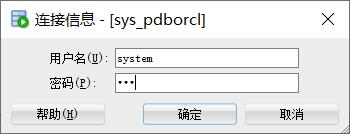
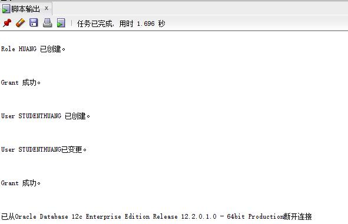
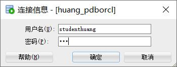
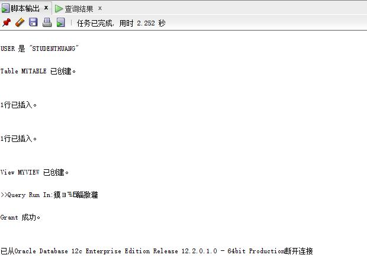
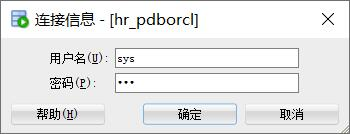
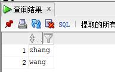
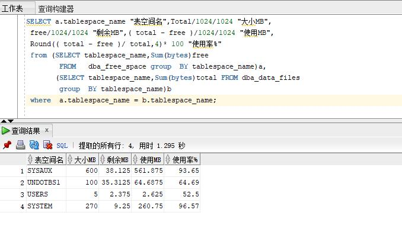

# 实验2：用户及权限管理

## 2018软件工程2班  黄浩 201810111210

## 实验目的：

掌握用户管理、角色管理、权根维护与分配的能力，掌握用户之间共享对象的操作技能。

## 实验内容：

Oracle有一个开发者角色resource，可以创建表、过程、触发器等对象，但是不能创建视图。本训练要求：

- 在pdborcl插接式数据中创建一个新的本地角色con_res_view，该角色包含connect和resource角色，同时也包含CREATE VIEW权限，这样任何拥有con_res_view的用户就同时拥有这三种权限。

- 创建角色之后，再创建用户new_user，给用户分配表空间，设置限额为50M，授予con_res_view角色。

- 最后测试：用新用户new_user连接数据库、创建表，插入数据，创建视图，查询表和视图的数据。

  

## 实验步骤：

- **第1步：以system登录到pdborcl，创建角色huang和用户studenthuang，并授权和分配空间：**

  **system登录：**

  

  代码：

  ```sql
  CREATE ROLE huang;
  GRANT connect,resource,CREATE VIEW TO huang;
  CREATE USER studenthuang IDENTIFIED BY 123 DEFAULT TABLESPACE users TEMPORARY TABLESPACE temp;
  ALTER USER studenthuang QUOTA 50M ON users;
  GRANT huang TO studenthuang;
  exit;
  ```

  运行结果：

  


- **第2步：新用户studenthuang连接到pdborcl，创建表mytable和视图myview，插入数据，最后将myview的SELECT对象权限授予hr用户**。

  studenthuang登录：

  

  代码：

  ```sql
  show user;
  CREATE TABLE mytable (id number,name varchar(50));
  INSERT INTO mytable(id,name)VALUES(1,'zhang');
  INSERT INTO mytable(id,name)VALUES (2,'wang');
  CREATE VIEW myview AS SELECT name FROM mytable;
  SELECT * FROM myview;
  GRANT SELECT ON myview TO hr;
  exit；
  ```

  运行结果：

  


- **第3步：用户hr连接到pdborcl，查询new_user授予它的视图myview**

  hr登录：

  

  代码：

  ```sql
  select * from studenthuang.myview;
  ```

  运行结果：

  

  

## 数据库和表空间占用分析

当全班同学的实验都做完之后，数据库pdborcl中包含了每个同学的角色和户。所有同学的用户都使用表空间users存储表的数据。表空间中存储了很多相同名称的表mytable和视图myview,分别属性于不同的用户，不会引起混淆。随着用户往表中插入数据，表空间的磁盘使用量会增加。

## 查看数据库的使用情况

以system身份进行查看

代码：

```sql
SELECT tablespace_name,FILE_NAME,BYTES/1024/1024 MB,MAXBYTES/1024/1024 MAX_MB,autoextensible FROM dba_data_files  WHERE  tablespace_name='USERS';
```

***autoextensible是显示表空间中的数据文件是否自动增加。***

***MAX_MB是指数据文件的最大容量。***

运行结果：


代码：

```sql
SELECT a.tablespace_name "表空间名",Total/1024/1024 "大小MB",
 free/1024/1024 "剩余MB",( total - free )/1024/1024 "使用MB",
 Round(( total - free )/ total,4)* 100 "使用率%"
 from (SELECT tablespace_name,Sum(bytes)free
        FROM   dba_free_space group  BY tablespace_name)a,
       (SELECT tablespace_name,Sum(bytes)total FROM dba_data_files
        group  BY tablespace_name)b
 where  a.tablespace_name = b.tablespace_name;
```



## 实验总结

通过本次实验我理解了Oracle中系统权限和对象权限的概念，能熟练进行用户权限的授予与回收。掌握了用户管理、角色管理、权根维护与分配的基本操作，收获了很多。