# 实验3：创建分区表

## 2018软件工程2班  黄浩 201810111210

## 实验目的：

掌握分区表的创建方法，掌握各种分区方式的使用场景。

## 实验内容：

- 本实验使用3个表空间：USERS,USERS02,USERS03。在表空间中创建两张表：订单表(orders)与订单详表(order_details)。

- 使用你自己的账号创建本实验的表，表创建在上述3个分区，自定义分区策略。

- 你需要使用system用户给你自己的账号分配上述分区的使用权限。你需要使用system用户给你的用户分配可以查询执行计划的权限。

- 表创建成功后，插入数据，数据能并平均分布到各个分区。每个表的数据都应该大于1万行，对表进行联合查询。

- 写出插入数据的语句和查询数据的语句，并分析语句的执行计划。

- 进行分区与不分区的对比实验。

  

## 实验步骤：

**第1步，以sysytem登录**

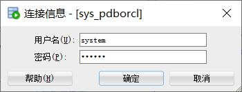

**第2步，在主表orders和从表order_details之间建立引用分区 在study用户中创建两个表：orders（订单表）和order_details（订单详表），两个表通过列order_id建立主外键关联。orders表按范围分区进行存储，order_details使用引用分区进行存储：**

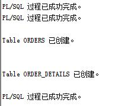

**第3步，使用system用户给你自己的账号分配上述分区的使用权限：**

代码：

```sql
ALTER USER studenthuang QUOTA UNLIMITED ON USERS;
ALTER USER studenghuang QUOTA UNLIMITED ON USERS02;
```

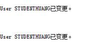

**第4步，使用studenthuang账号创建本实验的表，表创建在上述3个分区，自定义分区策略。**

- 在studenthuang用户下先测试即将要创建的表，若有就删除该表。

  代码：

  ```sql
  declare
        num   number;
  begin
        select count(1) into num from user_tables where TABLE_NAME = 'ORDER_DETAILS';
        if   num=1   then
            execute immediate 'drop table ORDER_DETAILS cascade constraints PURGE';
        end   if;
  
        select count(1) into num from user_tables where TABLE_NAME = 'ORDERS';
        if   num=1   then
            execute immediate 'drop table ORDERS cascade constraints PURGE';
        end   if;
  end;
  ```

  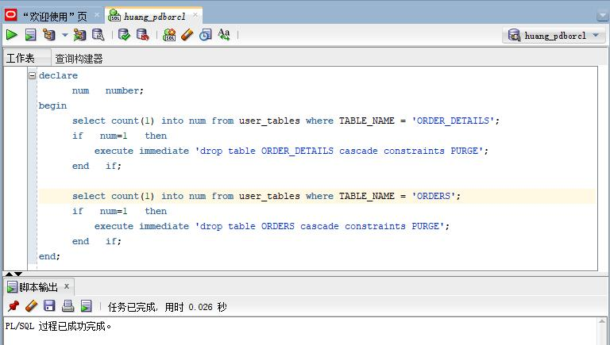

- 在用户studenthuang下创建'ORDERS'表，并创建了7个以时间为条件的分区。

  代码：

  ```sql
  CREATE TABLE ORDERS
  (
    ORDER_ID NUMBER(10, 0) NOT NULL
  , CUSTOMER_NAME VARCHAR2(40 BYTE) NOT NULL
  , CUSTOMER_TEL VARCHAR2(40 BYTE) NOT NULL
  , ORDER_DATE DATE NOT NULL
  , EMPLOYEE_ID NUMBER(6, 0) NOT NULL
  , DISCOUNT NUMBER(8, 2) DEFAULT 0
  , TRADE_RECEIVABLE NUMBER(8, 2) DEFAULT 0
  , CONSTRAINT ORDERS_PK PRIMARY KEY
    (
      ORDER_ID
    )
    USING INDEX
    (
        CREATE UNIQUE INDEX ORDERS_PK ON ORDERS (ORDER_ID ASC)
        LOGGING
        TABLESPACE USERS
        PCTFREE 10
        INITRANS 2
        STORAGE
        (
          BUFFER_POOL DEFAULT
        )
        NOPARALLEL
    )
    ENABLE
  )
  TABLESPACE USERS
  PCTFREE 10
  INITRANS 1
  STORAGE
  (
    BUFFER_POOL DEFAULT
  )
  NOCOMPRESS
  NOPARALLEL
  PARTITION BY RANGE (ORDER_DATE)
  (
    PARTITION PARTITION_2015 VALUES LESS THAN (TO_DATE(' 2016-01-01 00:00:00', 'SYYYY-MM-DD HH24:MI:SS', 'NLS_CALENDAR=GREGORIAN'))
    NOLOGGING
    TABLESPACE USERS
    PCTFREE 10
    INITRANS 1
    STORAGE
    (
      INITIAL 8388608
      NEXT 1048576
      MINEXTENTS 1
      MAXEXTENTS UNLIMITED
      BUFFER_POOL DEFAULT
    )
    NOCOMPRESS NO INMEMORY
  , PARTITION PARTITION_2016 VALUES LESS THAN (TO_DATE(' 2017-01-01 00:00:00', 'SYYYY-MM-DD HH24:MI:SS', 'NLS_CALENDAR=GREGORIAN'))
    NOLOGGING
    TABLESPACE USERS
    PCTFREE 10
    INITRANS 1
    STORAGE
    (
      BUFFER_POOL DEFAULT
    )
    NOCOMPRESS NO INMEMORY
  , PARTITION PARTITION_2017 VALUES LESS THAN (TO_DATE(' 2018-01-01 00:00:00', 'SYYYY-MM-DD HH24:MI:SS', 'NLS_CALENDAR=GREGORIAN'))
    NOLOGGING
    TABLESPACE USERS
    PCTFREE 10
    INITRANS 1
    STORAGE
    (
      BUFFER_POOL DEFAULT
    )
    NOCOMPRESS NO INMEMORY
  , PARTITION PARTITION_2018 VALUES LESS THAN (TO_DATE(' 2019-01-01 00:00:00', 'SYYYY-MM-DD HH24:MI:SS', 'NLS_CALENDAR=GREGORIAN'))
    NOLOGGING
    TABLESPACE USERS02
    PCTFREE 10
    INITRANS 1
    STORAGE
    (
      BUFFER_POOL DEFAULT
    )
    NOCOMPRESS NO INMEMORY
  , PARTITION PARTITION_2019 VALUES LESS THAN (TO_DATE(' 2020-01-01 00:00:00', 'SYYYY-MM-DD HH24:MI:SS', 'NLS_CALENDAR=GREGORIAN'))
    NOLOGGING
    TABLESPACE USERS02
    PCTFREE 10
    INITRANS 1
    STORAGE
    (
      BUFFER_POOL DEFAULT
    )
    NOCOMPRESS NO INMEMORY
  , PARTITION PARTITION_2020 VALUES LESS THAN (TO_DATE(' 2021-01-01 00:00:00', 'SYYYY-MM-DD HH24:MI:SS', 'NLS_CALENDAR=GREGORIAN'))
    NOLOGGING
    TABLESPACE USERS02
    PCTFREE 10
    INITRANS 1
    STORAGE
    (
      BUFFER_POOL DEFAULT
    )
    NOCOMPRESS NO INMEMORY
  , PARTITION PARTITION_2021 VALUES LESS THAN (TO_DATE(' 2022-01-01 00:00:00', 'SYYYY-MM-DD HH24:MI:SS', 'NLS_CALENDAR=GREGORIAN'))
    NOLOGGING
    TABLESPACE USERS03
    PCTFREE 10
    INITRANS 1
    STORAGE
    (
      BUFFER_POOL DEFAULT
    )
    NOCOMPRESS NO INMEMORY
  );
  ```

  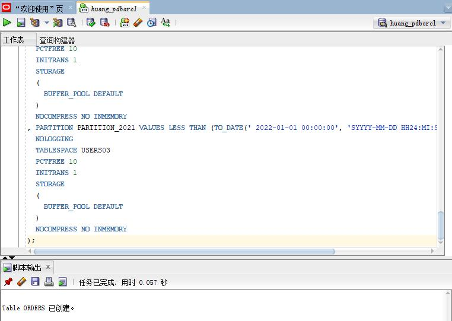

- 创建order_details表，表段放在表空间USERS中，分区依赖外键order_id。

  代码：

  ```sql
  CREATE TABLE order_details
  (
  id NUMBER(10, 0) NOT NULL
  , order_id NUMBER(10, 0) NOT NULL
  , product_name VARCHAR2(40 BYTE) NOT NULL
  , product_num NUMBER(8, 2) NOT NULL
  , product_price NUMBER(8, 2) NOT NULL
  , CONSTRAINT order_details_fk1 FOREIGN KEY  (order_id)
  REFERENCES orders  (  order_id   )
  ENABLE
  )
  TABLESPACE USERS
  PCTFREE 10 INITRANS 1
  STORAGE (BUFFER_POOL DEFAULT )
  NOCOMPRESS NOPARALLEL
  PARTITION BY REFERENCE (order_details_fk1);
  ```

  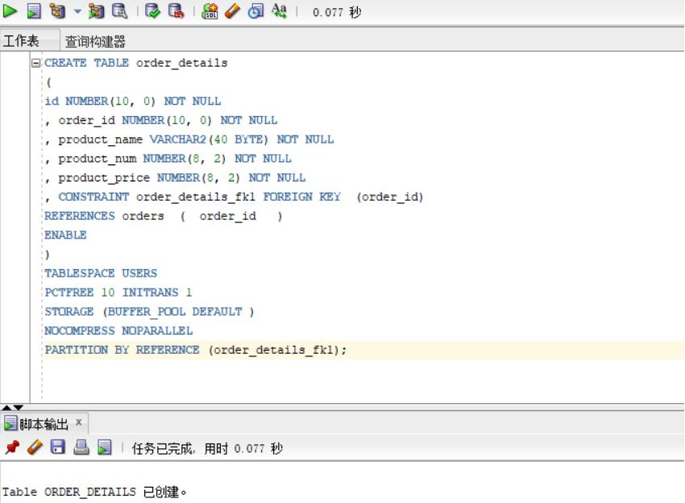

**第5步，使用system用户给studenthuang的账号分配上述分区的使用权限。使用system用户给你的用户分配可以查询执行计划的权限。**

```sql
ALTER USER studenthuang QUOTA UNLIMITED ON USERS;
ALTER USER studenthuang QUOTA UNLIMITED ON USERS02;
ALTER USER studenthuang QUOTA UNLIMITED ON USERS03;
exit
set autotrace on
select * from studenthuang.orders where order_date
between to_date('2017-1-1','yyyy-mm-dd') and to_date('2018-6-1','yyyy-mm-dd');
```

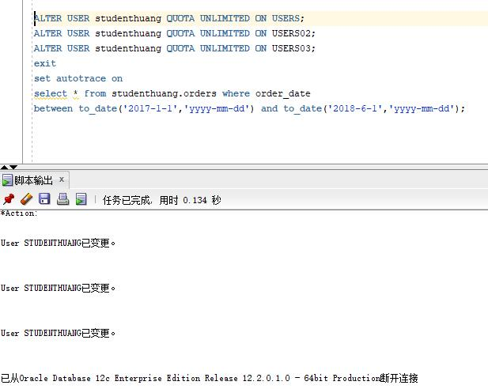

**第6步，表创建成功后，插入数据，数据能并平均分布到各个分区。每个表的数据都应该大于1万行，对表进行联合查询。**

- 执行查询语句1

```sql
select count(*) from orders;
```

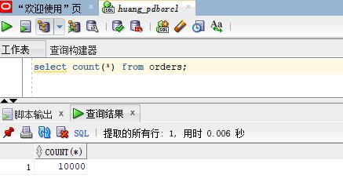

- 执行查询语句2

  ```sql
  select count(*) from order_details;
  ```

  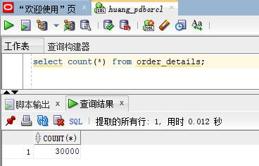

- 执行查询语句3

  ```sql
  select * from orders where order_date
  between to_date('2017-1-1','yyyy-mm-dd') and to_date('2018-6-1','yyyy-mm-dd'); 
  ```

  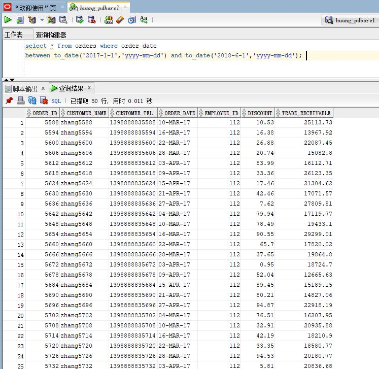

- 执行查询语句4

  ```sql
  select a.ORDER_ID,a.CUSTOMER_NAME,
  b.product_name,b.product_num,b.product_price
  from orders a,order_details b where
  a.ORDER_ID=b.order_id and
  a.order_date between to_date('2017-1-1','yyyy-mm-dd') and to_date('2018-6-1','yyyy-mm-dd');
  ```

  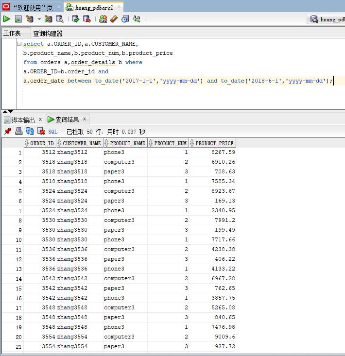

### 执行计划分析：

插入语句是用for循环从1至10000，循环插入数据至表中
第一个查询语句是从我创建的订单表中查询在2017年1月1日和2018年6月1日之间所有订单的信息，第二个查询语句是从我创建的订单表和订单详情中查询在2017年1月1日和2018年6月1日之间所有订单的ID，客户名，产品名，产品数以及产品价格。

## 实验总结：

通过本次实验我学会了分区表的创建，查询等基本操作。创建范围分区的关键字是“RANGE”，创建该分区后，其中的数据可以根据分区键值指定的范围进行分布，当数据在范围内均匀分布时，性能最好。

对于分区对象的查询可以仅搜索自己关心的分区，提高检索速度，如果表的某个分区出现故障，表在其他分区的数据仍然可用，因此具有更好的查询性能和可用性。

