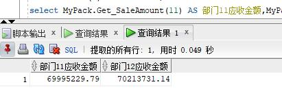

# 实验5：PL/SQL编程

## 18软件工程2班  黄浩 201810111210

## 实验目的：

1. 了解PL/SQL语言结构
2. 了解PL/SQL变量和常量的声明和使用方法
3. 学习条件语句的使用方法
4. 学习分支语句的使用方法
5. 学习循环语句的使用方法
6. 学习常用的PL/SQL函数
7. 学习包，过程，函数的用法。

## 实验场景：

假设有一个生产某个产品的单位，单位接受网上订单进行产品的销售。通过实验模拟这个单位的部分信息：员工表，部门表，订单表，订单详单表。
本实验以实验四为基础

## 实验步骤：

**第1步：以用户studenthuang，密码123登录**


**第2步：创建一个包，包名为MyPack**

代码：

```sql
create or replace PACKAGE MyPack IS
  /*
  本实验以实验4为基础。
  包MyPack中有：
  一个函数:Get_SaleAmount(V_DEPARTMENT_ID NUMBER)，
  一个过程:Get_Employees(V_EMPLOYEE_ID NUMBER)
  */
  FUNCTION Get_SaleAmount(V_DEPARTMENT_ID NUMBER) RETURN NUMBER;
  PROCEDURE Get_Employees(V_EMPLOYEE_ID NUMBER);
END MyPack;
/
```


**第3步：在MyPack中创建一个函数SaleAmount ，在MyPack中创建一个过程，在过程中使用游标，将背包赋予内容**

```sql
create or replace PACKAGE BODY MyPack IS
  FUNCTION Get_SaleAmount(V_DEPARTMENT_ID NUMBER) RETURN NUMBER
  AS
    N NUMBER(20,2); --注意，订单ORDERS.TRADE_RECEIVABLE的类型是NUMBER(8,2),汇总之后，数据要大得多。
    BEGIN
      SELECT SUM(O.TRADE_RECEIVABLE) into N  FROM ORDERS O,EMPLOYEES E
      WHERE O.EMPLOYEE_ID=E.EMPLOYEE_ID AND E.DEPARTMENT_ID =V_DEPARTMENT_ID;
      RETURN N;
    END;

  PROCEDURE GET_EMPLOYEES(V_EMPLOYEE_ID NUMBER)
  AS
    LEFTSPACE VARCHAR(2000);
    begin
      --通过LEVEL判断递归的级别
      LEFTSPACE:=' ';
      --使用游标
      for v in
      (SELECT LEVEL,EMPLOYEE_ID,NAME,MANAGER_ID FROM employees
      START WITH EMPLOYEE_ID = V_EMPLOYEE_ID
      CONNECT BY PRIOR EMPLOYEE_ID = MANAGER_ID)
      LOOP
        DBMS_OUTPUT.PUT_LINE(LPAD(LEFTSPACE,(V.LEVEL-1)*4,' ')||
                             V.EMPLOYEE_ID||' '||v.NAME);
      END LOOP;
    END;
END MyPack;
```

在MyPack中创建一个函数SaleAmount ，查询部门表，统计每个部门的销售总金额，每个部门的销售额是由该部门的员工(ORDERS.EMPLOYEE_ID)完成的销售额之和。函数SaleAmount要求输入的参数是部门号，输出部门的销售金额。 


**第4步：执行查询语句：**

查询部门表，统计每个部门的销售总金额，每个部门的销售额是由该部门的员工(ORDERS.EMPLOYEE_ID)完成的销售额之和。函数SaleAmount要求输入的参数是部门号，输出部门的销售金额。

代码：

```sql
select count(*) from orders;
select MyPack.Get_SaleAmount(11) AS 部门11应收金额,MyPack.Get_SaleAmount(12) AS 部门12应收金额 from dual;
```



递归查询某个员工及其所有下属，子下属员工。过程的输入参数是员工号，输出员工的ID,姓名，销售总金额。下面代码为递归查询1号员工及其所有下属。

代码：

```sql
set serveroutput on
DECLARE
  V_EMPLOYEE_ID NUMBER;    
BEGIN
  V_EMPLOYEE_ID := 1;
  MYPACK.Get_Employees (  V_EMPLOYEE_ID => V_EMPLOYEE_ID) ;  
  V_EMPLOYEE_ID := 11;
  MYPACK.Get_Employees (  V_EMPLOYEE_ID => V_EMPLOYEE_ID) ;    
END;
```


## 实验分析：

由于订单只是按日期分区的，上述统计是全表搜索，因此统计速度会比较慢，如何提高统计的速度呢？

答：可以通过创建索引，函数Get_SaleAmount的作用是：输入参数是部门号，输出部门的销售金额。在订单表按日期分区的情况下，会全表搜索，而此时，创建索引，这样进行查询的时候，就可以加快查询速度。

## 实验总结：

PL/SQL是一种面向过程的语言，是Oracle公司对SQL语言的功能的扩展，它是将过程性结构与oracle SQL无缝的集成在一起而产生的一种结构化的强有力的语言，是一种高级数据库程序设计语言。通过本次实验我学习了PL/SQL语言的结构和基本的使用，能够自己编写一些简单的PL/SQL语句，掌握了PL/SQL块结构和使用符合数据类型和游标的方法，收获了很多。