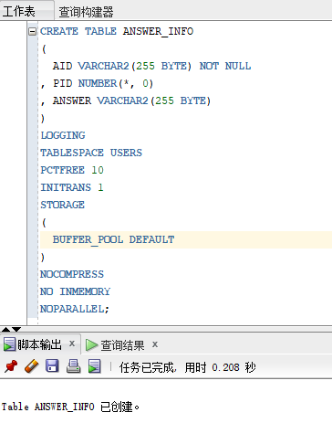

# 实验6：基于Oracle的在线考试系统数据库设计

## 2018软件工程2班  黄浩  201810111210

## 实验目的：

本次实验（期末项目）内容为基于oracle在线考试系统数据库的设计，为自选题目，要综合运用所学知识，如表设计、用户管理、PL/SQL设计、备份方案等，通过本次实验达到检验一学期所学知识的目的。

## 实验分析：

设计一个线上调查问卷系统，先进行系统分析，画出E-R图，然后创建用户、分配表空间、创建数据表，设计PL/SQL函数，对数据库进行备份和恢复。

**一、数据库设计**

数据库中有4张表，分别是用户信息表（user_info），试卷信息表（question_info），题目信息表（problem_info），答案信息表（answer_info）。

**二、实体属性**

用户信息实体：用户id（uid），用户名（uname），密码（password）。

试卷信息实体：试卷id（qid），所属用户id（uid），开始时间（beginTime），结束时间（endTime），问卷名（title）。

题目信息实体：题目id（pid），所属试卷id（qid），题目内容（content）。

答案信息实体：答案id（aid），所属题目id（pid），答案（answer）

**三、E-R图设计**


## 实验步骤：

**1：删除先前实验创建的表**

代码：

```sql
declare
      num   number;
begin
      select count(1) into num from user_tables where TABLE_NAME = 'DEPARTMENTS';
      if   num=1   then
          execute immediate 'drop table DEPARTMENTS cascade constraints PURGE';
      end   if;
      select count(1) into num from user_tables where TABLE_NAME = 'EMPLOYEES';
      if   num=1   then
          execute immediate 'drop table EMPLOYEES cascade constraints PURGE';
      end   if;
      select count(1) into num from user_tables where TABLE_NAME = 'ORDER_ID_TEMP';
      if   num=1   then
          execute immediate 'drop table ORDER_ID_TEMP cascade constraints PURGE';
      end   if;
      select count(1) into num from user_tables where TABLE_NAME = 'ORDER_DETAILS';
      if   num=1   then
          execute immediate 'drop table ORDER_DETAILS cascade constraints PURGE';
      end   if;
      select count(1) into num from user_tables where TABLE_NAME = 'ORDERS';
      if   num=1   then
          execute immediate 'drop table ORDERS cascade constraints PURGE';
      end   if;
      select count(1) into num from user_tables where TABLE_NAME = 'PRODUCTS';
      if   num=1   then
          execute immediate 'drop table PRODUCTS cascade constraints PURGE';
      end   if;
      select count(1) into num from user_sequences where SEQUENCE_NAME = 'SEQ_ORDER_DETAILS_ID';
      if   num=1   then
          execute immediate 'drop  SEQUENCE SEQ_ORDER_DETAILS_ID';
      end   if;
      select count(1) into num from user_sequences where SEQUENCE_NAME = 'SEQ_ORDER_ID';
      if   num=1   then
          execute immediate 'drop  SEQUENCE SEQ_ORDER_ID';
      end   if;
      select count(1) into num from user_views where VIEW_NAME = 'VIEW_ORDER_DETAILS';
      if   num=1   then
          execute immediate 'drop VIEW VIEW_ORDER_DETAILS';
      end   if;
      SELECT count(object_name)  into num FROM user_objects_ae WHERE object_type = 'PACKAGE' and OBJECT_NAME='MYPACK';
      if   num=1   then
          execute immediate 'DROP PACKAGE MYPACK';
      end   if;
end;
/
```


**2：用户创建与表空间分配**

先进行表空间的划分，分配两个表空间，由于该问卷可能因人数过多而使得查询变慢，故划分两个表空间users1和users2，users1用于存储用户id号为2.5万以前的，users2用于存储用户id号为2.5万以后的。

代码：

```sql
CREATE TABLESPACE User1
DATAFILE
'/home/oracle/app/oracle/oradata/orcl/pdborcl/pdbtest_user1_1.dbf'
    SIZE 100M AUTOEXTEND ON NEXT 256M MAXSIZE UNLIMITED,
'/home/oracle/app/oracle/oradata/orcl/pdborcl/pdbtest_user1_2.dbf'
    SIZE 100M AUTOEXTEND ON NEXT 256M MAXSIZE UNLIMITED
EXTENT MANAGEMENT LOCAL SEGMENT SPACE MANAGEMENT AUTO;

CREATE TABLESPACE Users2
DATAFILE
'/home/oracle/app/oracle/oradata/orcl/pdborcl/pdbtest_user2_1.dbf'
    SIZE 100M AUTOEXTEND ON NEXT 256M MAXSIZE UNLIMITED,
'/home/oracle/app/oracle/oradata/orcl/pdborcl/pdbtest_user2_2.dbf'
    SIZE 100M AUTOEXTEND ON NEXT 256M MAXSIZE UNLIMITED
EXTENT MANAGEMENT LOCAL SEGMENT SPACE MANAGEMENT AUTO;
```

**3：创建角色，用户和表空间的分配**

创建角色role1

代码：

```sql
CREATE ROLE role1 ;
GRANT SET CONTAINER,CREATE SESSION,CREATE TABLE,CREATE CLUSTER,
    CREATE OPERATOR,CREATE INDEXTYPE,CREATE TYPE,CREATE SEQUENCE,
    CREATE TRIGGER,CREATE PROCEDURE
    TO role1 container = all;
GRANT EM_EXPRESS_ALL TO role1 CONTAINER=ALL;
COL common FORMAT a7
SELECT * FROM dba_sys_privs WHERE  grantee='role1';
col grantee format a20
SELECT * FROM dba_role_privs WHERE  grantee='role1';
```


创建另一个角色role2

代码:

```sql
CREATE ROLE role2;
GRANT connect,resource TO role2;
COL grantee FORMAT a20
COL granted_role FORMAT a20
COL common FORMAT a7
COL role FORMAT a20
COL oracle_maintained FORMAT a15
SELECT * FROM dba_roles WHERE role='role2';
SELECT * FROM dba_role_privs WHERE  grantee ='role2';
SELECT * FROM dba_sys_privs WHERE grantee='role2';
```


system创建testuser用户，并给用户testuser分配表空间role1和role2的使用配额并分配testuser角色。

代码:

```sql
CREATE USER testuser IDENTIFIED BY 123

ALTER USER testuser QUOTA UNLIMITED ON USER1;
ALTER USER testuser QUOTA UNLIMITED ON USER2;

GRANT "CONNECT" TO testuser WITH ADMIN OPTION;
GRANT "RESOURCE" TO testuser WITH ADMIN OPTION;
ALTER USER testuser DEFAULT ROLE "CONNECT","RESOURCE";

GRANT CREATE VIEW TO testuser WITH ADMIN OPTION;
```


**4：创建数据库表**

1. 创建用户信息表

   代码:

   ```sql
   CREATE TABLE USER_INFO
   (
     USERID NUMBER(*, 0) NOT NULL
   , UNAME VARCHAR2(64 BYTE) 
   , PASSWORD VARCHAR2(64 BYTE) 
   ) 
   LOGGING 
   TABLESPACE USERS 
   PCTFREE 10 
   INITRANS 1 
   STORAGE 
   ( 
     BUFFER_POOL DEFAULT 
   ) 
   NOCOMPRESS 
   NO INMEMORY 
   NOPARALLEL;
   ```
   
   
   
   
   
2. 创建试卷信息表

   代码:

   ```sql
   CREATE TABLE QUESTION_INFO
   (
     QUEID NUMBER(*, 0) NOT NULL
   , USERID NUMBER(*, 0) NOT NULL
   , BEGINTIME DATE 
   , ENDTIME DATE 
   , TITLE VARCHAR2(255 BYTE) 
   ) 
   LOGGING 
   TABLESPACE USERS 
   PCTFREE 10 
   INITRANS 1 
   STORAGE 
   ( 
     BUFFER_POOL DEFAULT 
   ) 
   NOCOMPRESS 
   NO INMEMORY 
   NOPARALLEL;
   ```
   
   
   
3. 创建题目信息表

   代码:

   ```sql
   CREATE TABLE PROBLEM_INFO
   (
     PID NUMBER(*, 0) NOT NULL
   , QUEID NUMBER(*, 0) NOT NULL
   , CONTENT VARCHAR2(255 BYTE) 
   ) 
   LOGGING 
   TABLESPACE USERS 
   PCTFREE 10 
   INITRANS 1 
   STORAGE 
   ( 
     BUFFER_POOL DEFAULT 
   ) 
   NOCOMPRESS 
   NO INMEMORY 
   NOPARALLEL;
   ```
   
   
   
4. 创建答案信息表

   代码:

   ```sql
   CREATE TABLE ANSWER_INFO 
   (
     AID NUMBER(*, 0) NOT NULL 
   , PID NUMBER(*, 0) NOT NULL
   , ANSWER VARCHAR2(255 BYTE) 
   ) 
   LOGGING 
   TABLESPACE USERS 
   PCTFREE 10 
   INITRANS 1 
   STORAGE 
   ( 
     BUFFER_POOL DEFAULT 
   ) 
   NOCOMPRESS 
   NO INMEMORY 
   NOPARALLEL;
   ```
   



**5：PL/SQL设计**

PL/SQL是一种面向过程的语言，是Oracle公司对SQL语言的功能的扩展，它是将过程性结构与oracle SQL无缝的集成在一起而产生的一种结构化的强有力的、高级数据库程序设计语言。在数据库中建立一个程序包，在包中用PL/SQL语言设计存储过程和函数，实现比较复杂的业务逻辑，用模拟数据进行执行计划分析。

在数据库中建立一个程序包


   设计存储过程函数

   代码：

   ```sql
   CREATE OR REPLACE 
   PACKAGE GETUSERID AS 
   
       FUNCTION GetUserId()RETURN NUMBER;
   
   END GETUSERID;
   
   CREATE OR REPLACE PACKAGE BODY GETUSERID IS
       FUNCTION GetUserId()RETURN NUMBER
   AS 
       N NUMBER;
   BEGIN
       SELECT SUM(USERID)INTO N FROM USER_INFO;
       RETURN N;
   END;
   ```

   

   

   创建一个存储过程向user_info表存储数据。

   代码：

   ```sql
   CREATE OR REPLACE PROCEDURE INSERT_USER
       (UID IN USER_INFO.USERID%TYPE,
       UNAME IN USER_INFO.UNAME%TYPE,
       UPASSWORD IN USER_INFO.PASSWORD%TYPE,)
   IS 
       ept_null_error EXCEPTION;
       PRAGMA EXCEPTION_INIT(ept_null_erroe,-1400);
       
   Begin
       INSERT INTO USER_INFO (USERID,UNAME,PASSWORD) VALUES (UID,UNAME,UPASSWORD);
       DBMS_OUTPUT.PUT('成功');
   EXCEPTION
       WHEN DUP_VAL_ON_INDEX THEN
           RAISE_APPLICATION_ERROR(-101,'执行失败');
       WHEN ept_null_error THEN
           RAISE_APPLICATION_ERROR(-102,'不能为空');
   END INSERT_USER
   ```

   

   **6：数据库测试**

   插入10000条数据，执行完成后查看结果。

   查询结果

   

设计存储过程，删除指定id的用户

代码：

```sql
CREATE OR REPLACE PROCEDURE PROCEDURE1(ID IN NUMBER)
AS 
BEGIN
  delete from user_info where userid=ID;
  DBMS_OUTPUT.PUT_LINE(ID||'号已被删除 ');
END PROCEDURE1;
```

s


**7：备份和恢复**

数据库已经正常关闭的情况下，当正常关闭时会提供给我们一个完整的数据库。冷备份是将关键性文件拷贝到另外的位置。对于备份Oracle信息而言，冷备份是最快和最安全的方法。

```sql
sqlplus /nolog
sql>connect /as sysdba
sql>shutdown normal;
```


用拷贝命令备份全部的数据文件、重做日志文件、控制文件、初始化参数文件。通过命令

```sql
select v$tablespace.name，v$datafile.name from v$tablespace， v$datafile where v$tablespace.ts#= v$datafile.ts#；
```

查看文件位置然后拷贝。


重启数据库

```sql
sql>startup
```


## 实验总结:

通过本次课程设计实验，我对这一学期所学知识进行了巩固和复习，对数据库有了更深的了解。虽然在做实验时还遇到了很多了问题，比如网络不稳定、数据库操作失败、指令错误等，但通过查阅书籍和资料都得到了解决，最后使得本次实验能够完满完成。

通过本次实验，我对未来有了更多的信心，没有什么困难是不可战胜的。我明白了理论和实际结合的重要性，运用一学期所学知识做一个真正的数据库管理系统才是我们学习的价值所在，只有把理论知识和实践结合起来，从理论中得到结论，才能提高自己的动手能力和独立思考能力。